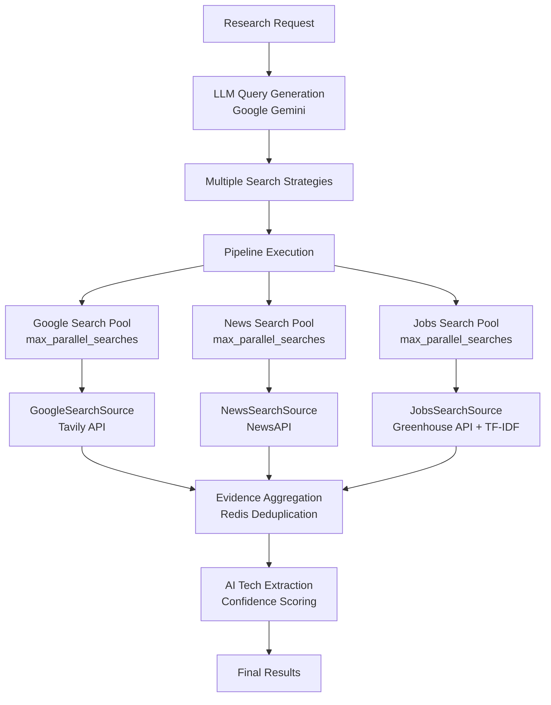

# GTM Research Engine - Backend

AI-powered research engine that analyzes companies using LLM-generated search strategies and parallel data collection across multiple sources.

## Features

- **LLM-Generated Strategies** - Google Gemini creates intelligent search queries
- **Parallel Processing** - Async worker pools for concurrent source queries
- **Multi-Source Intelligence** - Google Search (Tavily) + NewsAPI + Jobs Search (Greenhouse) + deduplication
- **Real-time Streaming** - Server-Sent Events for live progress updates
- **Technology Extraction** - AI-powered tech stack detection from evidence

## Quick Start

**Requirements:** Python 3.11+

```bash
# Install dependencies
uv sync

# Create environment file
cat > .env << EOF
GEMINI_API_KEY=your_gemini_api_key_here
TAVILY_API_KEY=your_tavily_api_key_here
NEWS_API_KEY=your_news_api_key_here
EOF

# Start server
uvicorn app.server:app --reload
```

**Get API Keys:**

- [Google Gemini](https://aistudio.google.com/) - LLM query generation
- [Tavily](https://tavily.com/) - Google Search API
- [NewsAPI](https://newsapi.org/register) - News data (1,000 requests/day free)

## API Endpoints

### Batch Research

`POST /api/research/batch`

```json
{
  "research_goal": "Find fintech companies using AI for fraud detection",
  "company_domains": ["stripe.com", "paypal.com"],
  "search_depth": "standard",
  "max_parallel_searches": 20,
  "confidence_threshold": 0.7
}
```

**Response:**

```json
{
  "research_id": "uuid",
  "results": [
    {
      "domain": "stripe.com",
      "confidence_score": 0.92,
      "findings": {
        "technologies": ["tensorflow", "python", "kubernetes"],
        "evidence": [{ "url": "...", "title": "...", "snippet": "..." }],
        "signals_found": 8
      }
    }
  ],
  "processing_time_ms": 3420
}
```

### Real-time Streaming

`POST /api/research/batch/stream`

Server-Sent Events with live progress updates:

```javascript
const eventSource = new EventSource("/api/research/batch/stream");
eventSource.addEventListener("domain_analyzed", (event) => {
  const data = JSON.parse(event.data);
  console.log(`${data.domain}: ${data.confidence}% confidence`);
});
```

## Architecture

### System Overview



### Data Sources

- **Google Search (Tavily)** - Site-specific searches, Boolean queries, file type filtering
- **News Search (NewsAPI)** - Press releases, funding news, security incidents, partnerships
- **Jobs Search (Greenhouse)** - Job postings with TF-IDF semantic matching for tech requirements

### Performance

- **Concurrent Processing**: Each source pool runs `max_parallel_searches` simultaneously
- **Semantic Job Matching**: TF-IDF vectorization with cosine similarity for intelligent job filtering
- **Rate Limiting**: Per-source semaphore pools prevent API overwhelming
- **Deduplication**: Redis-based evidence deduplication across all sources
- **~3-5x faster** with async domain processing vs sequential execution
